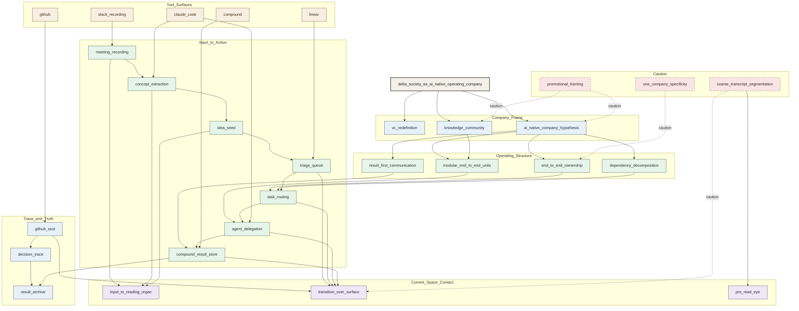

# delta_society node-link visual map v1

## 1. Purpose

This document renders the current `delta_society.md` reading as a compact node-link visual.

It is a reading aid, not a promotion decision.

## 2. Mermaid graph

## 3. Reading guide

- green nodes:
  - operational support chain
- blue nodes:
  - company/frame/trace structure
- tan nodes:
  - concrete tool surfaces
- purple nodes:
  - contact with current strong lines
- red dashed nodes:
  - caution / overread risk

## 4. Fast reading

- strongest support path:
  - `meeting_recording -> concept_extraction -> idea_seed -> triage_queue -> task_routing -> agent_delegation -> compound_result_store`
- strongest current-space contact:
  - `input_to_reading_organ`
  - `transition_over_surface`
- strongest caution:
  - `coarse_transcript_segmentation`
  - `promotional_framing`
  - `one_company_specificity`
